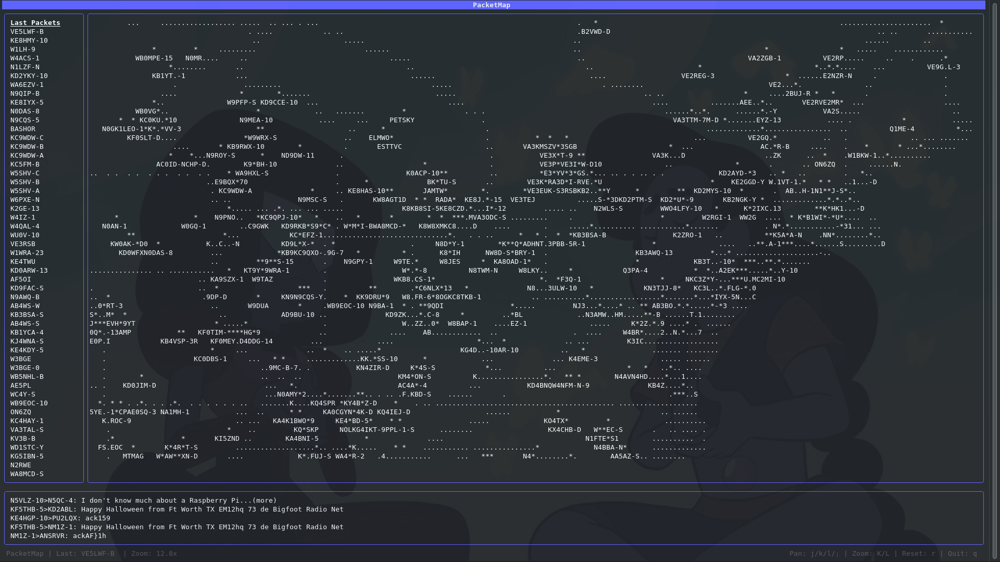

# PacketMap

PacketMap is a TUI (Terminal User Interface) application for plotting APRS (Automatic Packet Reporting System) data on an ASCII map in real-time.

Download the linux AMD64 Binary Here: https://sarahsforge.dev/products/packetmap-linux



# 🗺️ Features

Real-time Plotting: Plots APRS position packets on an ASCII map as they are received.

Dual-Source Connection:

Connects to KISS TNCs (via Serial port or TCP/IP).

Connects to the APRS-IS network (internet stream).

Interactive Map: Pan and zoom the map to explore your area or the world.

Packet Sidebar: A live-updating log of the most recently heard stations.

Configurable: All settings are managed in a simple config.toml file.

# 📝 Configuration

To use PacketMap, create a file named config.toml in the same directory as the application executable.

Example 1: APRS-IS (Internet)

This is the easiest way to get started. You must provide your own callsign and APRS-IS passcode.
Ini, TOML

```
[station]
# Your callsign
callsign = "N0CALL"
# Your 4 or 6-digit gridsquare (used for centering the map)
gridsquare = "EN91"

[map]
# The initial zoom level to start with
defaultzoom = 12.8

[interface]
# Set type to APRSIS
type = "APRSIS"

# Device is ignored for APRSIS
device = "" 

# Your APRS-IS passcode. Required for a verified connection.
passcode = 00000
```

# Example 2: KISS TNC (Serial or TCP)

Use this for connecting to a physical TNC or a software TNC like Direwolf.
Ini, TOML


```
[station]
callsign = "N0CALL"
gridsquare = "EN91"

[map]
defaultzoom = 12.8

[interface]
# Set type to KISS
type = "KISS"

# For a TCP TNC (like Direwolf):
device = "127.0.0.1:8001"

# For a Serial TNC:
# device = "/dev/ttyUSB0" # (Linux)
# device = "COM3"         # (Windows)

# Passcode is ignored for KISS connections
passcode = 0
```

# ⌨️ Controls

Run the application from your terminal:
Bash

./packetmap

# Key Bindings

Key	Action
j / k / l / ;	Pan Map (Left/Up/Down/Right)
K (Shift+k)	Zoom In
L (Shift+l)	Zoom Out
r	Reset map to original zoom/position
q / esc / ctrl+c	Quit the application